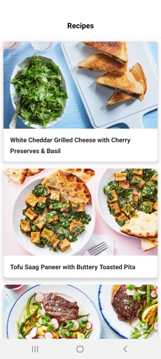
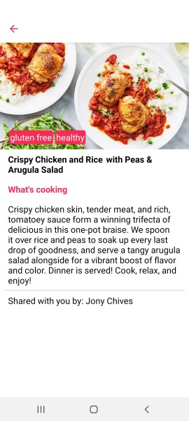
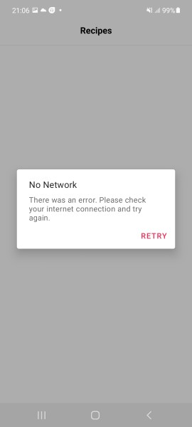

# Recipes App

This is a sample Recipe app that display Recipe list and the details.
The first page displays Recipe list, when one of the items is clicked, it show the detail of the selected Recipe.

## SetUP
This project requires the following.

1. Used Android Studio 4.2.2
2. Android SDK 23 or above.
3. Cloe or Download as Zip from the Repo, Build and Run.

## Screenshots
The screenshot below shows how the app looks like.

## About the project
All the data is coming from the Contentful SDK.
The response contains a list of Recipes items as well as URLs to the pictures associated with each story.

## Tech stack
1. Kotlin
2. Dagger for Dependency injection.
3. CDA Client for Contentful.
4. ViewModel.
5. ViewBinding.
6. Coroutines for asynchronous code.

